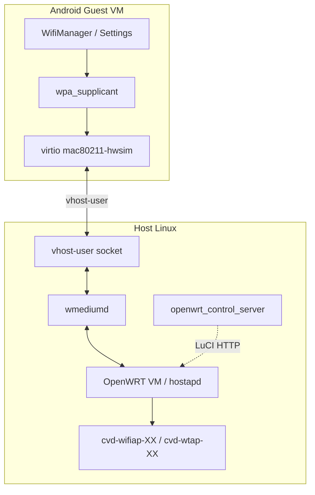

# Cuttlefish WiFi 模拟功能说明

本文档说明 Cuttlefish 中 WiFi 仿真的架构、使用方法、可配置参数，以及面向自动化测试的 Host 侧接口。内容基于 `android-cuttlefish` 仓库源码整理。

---

## 目录

1. [功能概述](#1-功能概述)
2. [架构与数据流](#2-架构与数据流)
3. [前置条件](#3-前置条件)
4. [普通用户使用方式](#4-普通用户使用方式)
5. [Host 侧配置参数](#5-host-侧配置参数)
6. [网络接口与 IP 规划](#6-网络接口与-ip-规划)
7. [Host 侧编程接口](#7-host-侧编程接口)
8. [日志与排障](#8-日志与排障)
9. [非 Debian 环境（如 openEuler）](#9-非-debian-环境如-openeuler)
10. [与蜂窝 / netsim 的区别](#10-与蜂窝--netsim-的区别)
11. [相关源码索引](#11-相关源码索引)

---

## 1. 功能概述

Cuttlefish 的 WiFi **不是**给 Guest 简单挂一块以太网 TAP，而是通过以下组件在 Host 上搭建完整的无线仿真环境：

| 组件 | 二进制 / 进程 | 作用 |
|------|----------------|------|
| **wmediumd** | `wmediumd` | 模拟 IEEE 802.11 无线介质（多站点、衰减、SNR、抓包等） |
| **OpenWRT AP VM** | `crosvm` 启动的 OpenWRT 实例 | 模拟 WiFi 热点（hostapd），Guest 可扫描并连接 SSID |
| **Guest WiFi 网卡** | virtio `mac80211-hwsim` | Android 内看到的 WiFi 芯片，经 vhost-user 连到 wmediumd |
| **Host TAP/Bridge** | `cuttlefish-host-resources` 创建 | 把 OpenWRT AP 接到 Host 网络栈 |
| **openwrt_control_server** | `openwrt_control_server` | 通过 gRPC 控制 OpenWRT（LuCI RPC） |

**默认行为：** `enable_wifi=true`，`virtio_mac80211_hwsim=true`（见 `flags_defaults.h`）。正常启动 Cuttlefish 后，Guest 内应能看到 WiFi 并可连接 AP。

---

## 2. 架构与数据流



**启动顺序（简化）：**

1. `assemble_cvd` 写入 `CuttlefishConfig`（`enable_wifi`、tap 名、wmediumd socket 路径等）。
2. `run_cvd` 在**第一个实例**上启动 `wmediumd`（若未指定外部 socket）。
3. `wmediumd_gen_config` 自动生成 `wmediumd.cfg`（或使用 `--wmediumd_config` 指定）。
4. `run_cvd` 启动 OpenWRT crosvm（需 `ap_kernel_image` + `ap_rootfs_image` 均可用）。
5. Guest crosvm 通过 `--vhost-user=mac80211-hwsim,socket=...` 接入 wmediumd。
6. `openwrt_control_server` 在 `enable_wifi=true` 时启动。

---

## 3. 前置条件

### 3.1 Debian / Ubuntu（官方路径）

```bash
sudo apt install cuttlefish-base
sudo usermod -aG kvm,cvdnetwork,render $USER
sudo reboot
```

`cuttlefish-host-resources` 服务会在启动时创建 WiFi 相关 bridge/tap（见 `base/debian/cuttlefish-base.cuttlefish-host-resources.init`）。

用户需属于 `cvdnetwork` 组，才能使用 TAP 设备和 `vhost-net` 等。

### 3.2 Host Package 中的 OpenWRT 镜像

默认 AP 镜像路径（相对 host package 根目录，即 `cuttlefish-common/`）：

| 架构 | 内核 | rootfs |
|------|------|--------|
| x86_64 | `etc/openwrt/images/openwrt_kernel_x86_64` | `etc/openwrt/images/openwrt_rootfs_x86_64` |
| arm64 | `etc/openwrt/images/openwrt_kernel_aarch64` | `etc/openwrt/images/openwrt_rootfs_aarch64` |

`assemble_cvd` 在检测到目标架构后会通过 `SetDefaultFlagsForOpenwrt()` 设置上述默认路径。若镜像缺失，OpenWRT AP 无法启动，Guest WiFi 无法关联。

### 3.3 权限与内核能力

- `/dev/kvm`
- `/dev/vhost-net`（TAP 加速）
- 可创建 / 使用 TAP 设备（`cvd-wifiap-XX` 等）

---

## 4. 普通用户使用方式

### 4.1 默认启动（推荐）

使用 `launch_cvd` 或 `cvd create` + `cvd start`，**无需额外 WiFi 参数**：

```bash
# 传统方式
launch_cvd --cpus=4 --memory_mb=4096 ...

# 新 CLI
cvd fetch --default_build=@ab/aosp-android-latest-release/aosp_cf_x86_64_only_phone-userdebug
cvd create --default_build=...
cvd start
```

Guest 启动后：

1. 打开 **Settings → Network & internet → Internet → WiFi**
2. 扫描并连接 OpenWRT 广播的 SSID
3. 应用通过标准 Android API（`WifiManager`、`ConnectivityManager`）使用网络

### 4.2 关闭 WiFi 仿真

单实例：

```bash
launch_cvd --enable_wifi=false ...
```

多实例（按实例分别控制，逗号分隔）：

```bash
launch_cvd --num_instances=2 --enable_wifi=true,false ...
```

### 4.3 使用外部 wmediumd

适用于需要自己管理无线拓扑、或多环境共享同一 wmediumd 的场景：

```bash
# 先手动启动 wmediumd，监听指定 vhost-user socket
wmediumd -u /path/to/vhost_user.sock -c /path/to/wmediumd.cfg

# Cuttlefish 不再自动启动 wmediumd，而是连接该 socket
launch_cvd --vhost_user_mac80211_hwsim=/path/to/vhost_user.sock ...
```

当 `--vhost_user_mac80211_hwsim` 非空时，`assemble_cvd` **不会**自动启动 wmediumd 进程。

### 4.4 自定义 wmediumd 拓扑

```bash
launch_cvd --wmediumd_config=/path/to/custom/wmediumd.cfg ...
```

未指定时，首个实例启动前会执行：

```bash
wmediumd_gen_config -o <env-dir>/wmediumd.cfg -p <mac_prefix>
```

默认 `mac_prefix=5554`，配置支持最多 16 个 Cuttlefish 实例（含 AP）。

### 4.5 自定义 OpenWRT AP 镜像

```bash
launch_cvd \
  --ap_kernel_image=/path/to/openwrt_kernel \
  --ap_rootfs_image=/path/to/openwrt_rootfs \
  ...
```

**注意：** `ap_kernel_image` 与 `ap_rootfs_image` 必须**同时**指定或**同时**省略，否则 `assemble_cvd` 会直接 `FATAL`。

---

## 5. Host 侧配置参数

### 5.1 命令行 Flag（`launch_cvd` / `assemble_cvd`）

| Flag | 类型 | 默认值 | 说明 |
|------|------|--------|------|
| `--enable_wifi` | bool 向量 | `true` | 是否启用 WiFi；多实例可 per-instance |
| `--wmediumd_config` | string | 空（自动生成） | wmediumd 配置文件路径 |
| `--vhost_user_mac80211_hwsim` | string | 空（自动创建 UDS） | 外部 wmediumd 的 vhost-user socket |
| `--ap_kernel_image` | string | 按架构默认 | OpenWRT 内核镜像 |
| `--ap_rootfs_image` | string | 按架构默认 | OpenWRT rootfs 镜像 |

### 5.2 CuttlefishConfig 内部字段（调试时可查 JSON）

环境级（`EnvironmentSpecific`）：

| 字段 | 说明 |
|------|------|
| `enable_wifi` | 环境是否启用 WiFi |
| `start_wmediumd` | 是否由 Cuttlefish 管理 wmediumd |
| `vhost_user_mac80211_hwsim` | vhost-user socket 路径 |
| `wmediumd_api_server_socket` | wmediumd 控制 API socket |
| `wmediumd_config` | wmediumd 配置文件路径 |
| `wmediumd_mac_prefix` | 生成 MAC 地址前缀（默认 5554） |

实例级（`InstanceSpecific`）：

| 字段 | 说明 |
|------|------|
| `has_wifi_card` | 该实例是否有 WiFi 网卡 |
| `wifi_tap_name` | Host TAP 名（`cvd-wifiap-XX` 或 `cvd-wtap-XX`） |
| `use_bridged_wifi_tap` | 是否使用桥接 WiFi tap 模式 |
| `wifi_bridge_name` | WiFi bridge 名（默认 `cvd-wbr`） |
| `start_wmediumd_instance` | 是否由**该实例**启动 wmediumd（仅首个实例为 true） |

### 5.3 `cvd load` JSON 配置的现状

当前 `load_config.proto` 中 `Connectivity` 消息**仅包含** `vsock` 和 `modem_simulator_sim_type`，**没有** WiFi 字段。WiFi 目前主要通过 CLI flag 或默认行为控制，不能单靠 `cvd load` JSON 精细配置 WiFi（除非间接通过 flag 映射，见 parser 文档中的 `connectivity--wifi` 关系图，但 proto 尚未扩展）。

---

## 6. 网络接口与 IP 规划

由 `cuttlefish-host-resources.init` 创建（`num_cvd_accounts` 决定实例数量，默认 10）：

### 6.1 接口命名

| 模式 | TAP 接口 | Bridge | 说明 |
|------|----------|--------|------|
| **非桥接（推荐多 OpenWRT）** | `cvd-wifiap-01` … `cvd-wifiap-128` | 无独立 WiFi bridge | 每实例独立子网，可同时跑多个 OpenWRT |
| **桥接（legacy）** | `cvd-wtap-01` … | `cvd-wbr` | 多 tap 共享 `192.168.96.0/24` |

选择逻辑（`assemble_cvd/flags.cc`）：若 `cvd-wifiap-XX` 风格接口已存在，或启用 `cvdalloc`，则 `use_bridged_wifi_tap=false`；否则回退桥接模式。

### 6.2 IPv4 地址规划

| 接口 / 用途 | 网段 |
|-------------|------|
| `cvd-wbr` + `cvd-wtap-XX` | `192.168.96.0/24` |
| `cvd-wifiap-01` ~ `cvd-wifiap-64` | `192.168.94.0/24`（按实例编号分配主机位） |
| `cvd-wifiap-65` ~ `cvd-wifiap-128` | `192.168.95.0/24` |
| 蜂窝 `cvd-mtap-XX` | `192.168.97.0/24` / `192.168.93.0/24`（与 WiFi 无关） |

OpenWRT WAN 地址由 `openwrt_args.cpp` 根据实例号和 tap 模式写入内核 cmdline，OpenWRT 启动脚本 `0_default_config` 读取并配置 UCI。

**非桥接模式示例（实例 1）：**

- `wan_gateway`: `192.168.94.1`
- `wan_ipaddr`: `192.168.94.2`
- `wan_broadcast`: `192.168.94.3`

---

## 7. Host 侧编程接口

### 7.1 wmediumd gRPC API（无线介质仿真）

**服务名：** `wmediumdserver.WmediumdService`  
**Proto 来源：** AOSP `platform/external/wmediumd` → `wmediumd_server/wmediumd.proto`  
**监听：** `run_cvd` 为 wmediumd 传入 `--grpc_uds_path=<instance>/grpc_socket/WmediumdServer.sock`

**启动命令（由 run_cvd 构造）：**

```text
wmediumd \
  -u <vhost_user_mac80211_hwsim socket> \
  -a <wmediumd_api_server_socket> \
  -c <wmediumd.cfg> \
  --grpc_uds_path=<...>/grpc_socket/WmediumdServer.sock
```

| RPC | 请求 | 作用 |
|-----|------|------|
| `ListStations` | `Empty` | 列出所有仿真 WiFi 站点（MAC、位置、发射功率等） |
| `LoadConfig` | `LoadConfigRequest{path}` | 加载配置文件 |
| `ReloadConfig` | `Empty` | 重新加载当前配置 |
| `SetPosition` | `SetPositionRequest{mac, x, y}` | 设置站点二维坐标（影响链路） |
| `SetSnr` | `SetSnrRequest{mac1, mac2, snr}` | 设置两站点间信噪比 |
| `SetTxpower` | `SetTxpowerRequest{mac, tx_power}` | 设置发射功率 |
| `SetLci` | `SetLciRequest{mac, lci}` | 设置 LCI 定位信息 |
| `SetCivicloc` | `SetCiviclocRequest{mac, civicloc}` | 设置 civic 定位信息 |
| `StartPcap` | `StartPcapRequest{path}` | 开始抓包 |
| `StopPcap` | `Empty` | 停止抓包 |

**典型路径（实例 1，运行时目录因用户/配置而异）：**

```text
$HOME/cuttlefish-runtime/instances/cvd-1/grpc_socket/WmediumdServer.sock
$HOME/cuttlefish-runtime/environments/env-1/uds/wmediumd_api_server
$HOME/cuttlefish-runtime/environments/env-1/uds/vhost_user_mac80211
$HOME/cuttlefish-runtime/environments/env-1/wmediumd.cfg
```

可用 `grpcurl` 探测（需安装 grpcurl 与 proto 文件）：

```bash
grpcurl -plaintext -unix \
  -proto wmediumd.proto \
  "$HOME/cuttlefish-runtime/instances/cvd-1/grpc_socket/WmediumdServer.sock" \
  wmediumdserver.WmediumdService/ListStations
```

### 7.2 OpenWRT 控制 gRPC API

**Proto：** `cuttlefish/host/commands/openwrt_control_server/openwrt_control.proto`  
**进程：** `openwrt_control_server`  
**监听：** `<instance>/grpc_socket/OpenwrtControlServer.sock`  
**启用条件：** `environment.enable_wifi() == true`

```protobuf
service OpenwrtControlService {
  rpc LuciRpc (LuciRpcRequest) returns (LuciRpcReply) {}
  rpc OpenwrtIpaddr (google.protobuf.Empty) returns (OpenwrtIpaddrReply) {}
}

message LuciRpcRequest {
  string subpath = 1;   // LuCI RPC 子路径，如 "sys"
  string method = 2;    // 如 "exec"
  repeated string params = 3;  // 如 ["service network restart"]
}
```

**内置使用示例**（snapshot 恢复后，`boot_state_machine.cc`）：

```cpp
request.set_subpath("sys");
request.set_method("exec");
request.add_params("service network restart");
stub_->LuciRpc(&context, request, &response);
```

**`OpenwrtIpaddr`：** 从 `launcher.log` 解析 `wan_ipaddr=...`，返回 OpenWRT 管理 IP。

LuCI 认证默认使用 `root` / `password`（见 `openwrt_control_server/main.cpp` 中 `UpdateLuciRpcAuthKey()`）。

### 7.3 启动事件：WiFi 连接通知

`kernel_log_monitor` 解析 Guest 串口/日志，匹配消息后通过事件管道上报：

| 日志关键字 | 事件名 |
|------------|--------|
| `VIRTUAL_DEVICE_NETWORK_WIFI_CONNECTED` | `WifiNetworkConnected` |

定义见 `host/libs/config/config_constants.h`。

自动化测试可订阅该事件，在 WiFi 关联完成后再执行用例（与 `VIRTUAL_DEVICE_BOOT_COMPLETED` 用法类似）。

### 7.4 Guest 侧接口（应用开发者）

对 Android 应用透明，使用标准 API 即可：

- `android.net.wifi.WifiManager`
- `android.net.ConnectivityManager`
- Settings UI

Guest 内核侧为 `mac80211_hwsim` + `wpa_supplicant`，不暴露 Cuttlefish 专有 Java API。

### 7.5 Host 网络 Debug 接口

在 Host 上可直接操作 TAP 抓包：

```bash
# 查看接口
ip link show | grep cvd-wifi

# 抓包（实例 1，非桥接模式）
sudo tcpdump -i cvd-wifiap-01 -n

# 查看 bridge（桥接模式）
ip addr show cvd-wbr
```

---

## 8. 日志与排障

### 8.1 关键日志文件

路径相对于实例 / 环境运行时目录下的 `logs/`：

| 日志 | 文件名 | 内容 |
|------|--------|------|
| wmediumd | `wmediumd.log`（log_tee 命名） | 无线介质仿真 |
| OpenWRT crosvm | `crosvm_openwrt.log` | AP VM 运行日志 |
| OpenWRT 启动 | `crosvm_openwrt_boot.log` | AP 启动阶段 |
| 总控 | `launcher.log` | 含 `wan_ipaddr=`，供 openwrt_control 解析 |

### 8.2 进程检查

```bash
# wmediumd 应在首个实例所在环境运行
pgrep -a wmediumd

# OpenWRT 由 crosvm 启动，日志中可见 openwrt 相关参数
pgrep -a crosvm | grep openwrt

# openwrt 控制服务
pgrep -a openwrt_control_server
```

### 8.3 常见问题

| 现象 | 可能原因 | 处理 |
|------|----------|------|
| Guest 无 WiFi 开关 / 扫描不到 AP | `enable_wifi=false` 或 guest 无 mac80211 | 检查 flag 与 guest image |
| `Failed to validate tap interface: cvd-wifiap-01` | host-resources 未创建 TAP | 运行 host-resources 或手动创建 |
| wmediumd 启动失败 | 权限、libnl、socket 冲突 | 查 `wmediumd.log`，确认 UDS 路径可写 |
| OpenWRT 未启动 | AP 镜像路径错误或缺失 | 确认 `etc/openwrt/images/*` 存在 |
| 连接 AP 后无网 | OpenWRT hostapd 已知问题 | `run_cvd` 会在首次启动后 reboot OpenWRT（见 `open_wrt.cpp` TODO b/305102099） |
| 使用外部 wmediumd 仍超时 | socket 路径不一致 | 核对 `--vhost_user_mac80211_hwsim` 与 wmediumd `-u` 参数 |

### 8.4 验证 WiFi 已连接

**Guest 内：**

```bash
adb shell dumpsys wifi | grep "Wi-Fi is"
adb shell ping -c 3 8.8.8.8
```

**Host 事件：**

在 kernel log / 串口输出中搜索 `VIRTUAL_DEVICE_NETWORK_WIFI_CONNECTED`。

---

## 9. 非 Debian 环境（如 openEuler）

官方 `cuttlefish-host-resources` 为 Debian init 脚本，openEuler 需**手动等价配置**：

1. **用户组：** 创建或使用 `cvdnetwork` 组，将运行用户加入 `kvm`、`cvdnetwork`、`render`。
2. **创建 bridge/tap：** 参照 `base/debian/cuttlefish-base.cuttlefish-host-resources.init` 中 Wireless Network 段，至少为实例 1 创建 `cvd-wifiap-01` 并配置 `192.168.94.1/24` 网关侧地址。
3. **内核模块：** 加载 tun/tap；确保 mac80211_hwsim 在 Guest 内核中启用（Cuttlefish guest 默认已包含）。
4. **不要设置错误的 `LD_LIBRARY_PATH`：** 系统库应通过 `ld.so.cache` 解析，错误路径会导致 host 工具无法启动（包括 wmediumd）。
5. **OpenWRT 镜像：** 从 `cvd-host_package` 解压得到 `cuttlefish-common/etc/openwrt/images/`，或显式 `--ap_*_image` 指向有效文件。

最小示例（仅实例 1，需 root）：

```bash
ip link add cvd-wifiap-01 type dummy   # 仅示意；生产应使用 tun/tap
# 实际应使用 init 脚本中的 create_interface 逻辑创建 tun tap 并配置地址
```

建议直接移植 `cuttlefish-base.cuttlefish-host-resources.init` 中的 `create_interface` / `destroy_interface` 函数为 systemd 服务或开机脚本。

---

## 10. 与蜂窝 / netsim 的区别

| 能力 | 实现 | 主要 Flag / 组件 |
|------|------|------------------|
| **WiFi** | wmediumd + OpenWRT + mac80211_hwsim | `--enable_wifi`, `wmediumd`, `openwrt_control_server` |
| **蜂窝 / RIL** | modem_simulator + TAP | `--enable_modem_simulator`, `cvd-mtap-XX` |
| **蓝牙 / UWB / NFC（netsim）** | netsim / netsimd | `--netsim_bt`, `--netsim_uwb`, `--netsim_args` |

`--netsim_args=--wifi-instance=1` 属于 **netsim** 无线电仿真参数，与上述 **wmediumd WiFi 主路径不同**。一般 Cuttlefish 手机镜像的 WiFi 指 wmediumd 方案，不要与 netsim 的 wifi-instance 混淆。

---

## 11. 相关源码索引

| 主题 | 路径 |
|------|------|
| WiFi flag 默认值 | `base/cvd/cuttlefish/host/commands/assemble_cvd/flags_defaults.h` |
| 组装配置逻辑 | `base/cvd/cuttlefish/host/commands/assemble_cvd/flags.cc` |
| wmediumd 启动 | `base/cvd/cuttlefish/host/commands/run_cvd/launch/wmediumd_server.cpp` |
| OpenWRT 启动 | `base/cvd/cuttlefish/host/commands/run_cvd/launch/open_wrt.cpp` |
| OpenWRT 控制 gRPC | `base/cvd/cuttlefish/host/commands/openwrt_control_server/` |
| OpenWRT 启动参数 / IP | `base/cvd/cuttlefish/host/libs/config/openwrt_args.cpp` |
| Guest mac80211 接入 | `base/cvd/cuttlefish/host/libs/vm_manager/crosvm_manager.cpp` |
| Host tap 创建 | `base/debian/cuttlefish-base.cuttlefish-host-resources.init` |
| WiFi 连接事件 | `base/cvd/cuttlefish/host/commands/kernel_log_monitor/kernel_log_server.cc` |
| wmediumd 第三方库 | `base/cvd/build_external/wmediumd/`（来自 `platform/external/wmediumd`） |
| Host 打包 | `base/cvd/cuttlefish/package/BUILD.bazel`（含 `wmediumd`, `wmediumd_gen_config`） |

---

## 附录：快速命令参考

```bash
# 默认启用 WiFi 启动
launch_cvd --cpus=4 --memory_mb=4096

# 关闭 WiFi
launch_cvd --enable_wifi=false

# 自定义 wmediumd 配置
launch_cvd --wmediumd_config=/path/to/wmediumd.cfg

# 使用外部 wmediumd
wmediumd -u /tmp/cf-wmediumd.sock -c /path/to/wmediumd.cfg &
launch_cvd --vhost_user_mac80211_hwsim=/tmp/cf-wmediumd.sock

# Guest 内检查
adb shell cmd wifi status
adb shell dumpsys connectivity | grep -i wifi
```

---

*文档版本：与 android-cuttlefish 1.57.x 源码同步。若升级 host package，请以对应 tag 的源码为准核对路径与默认行为。*
