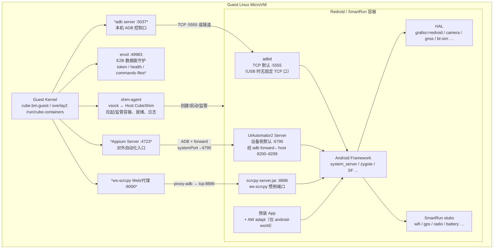
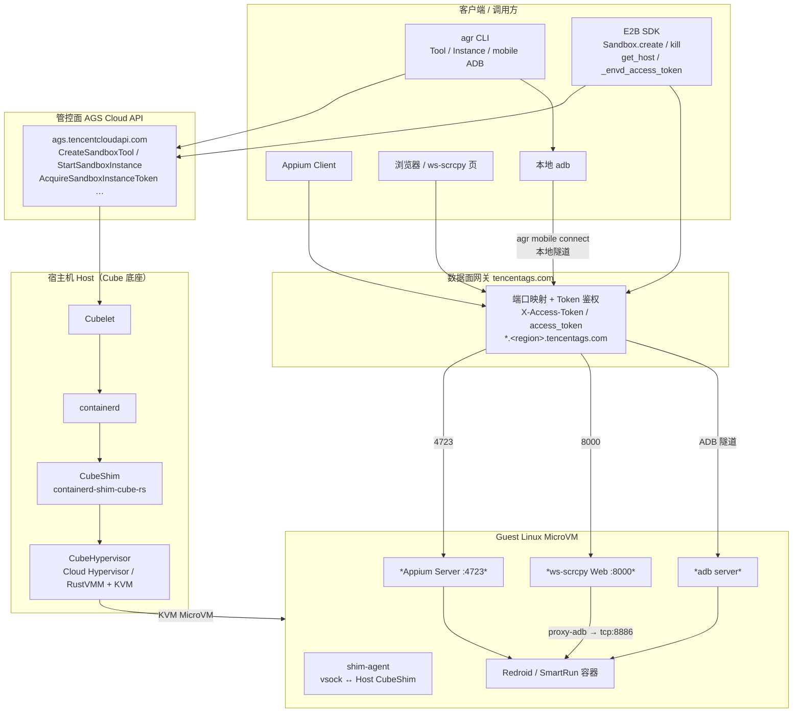
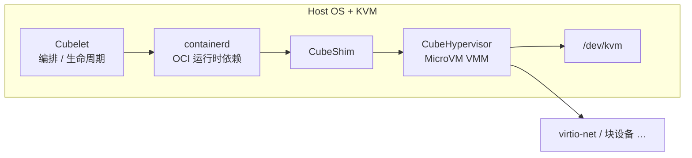
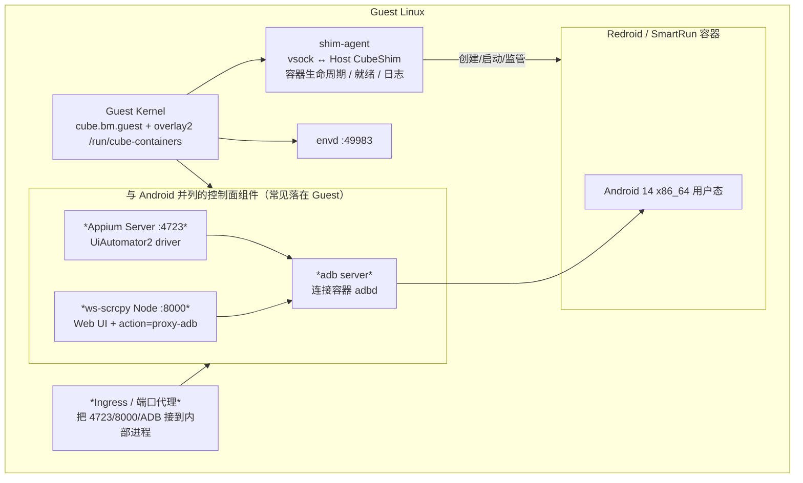
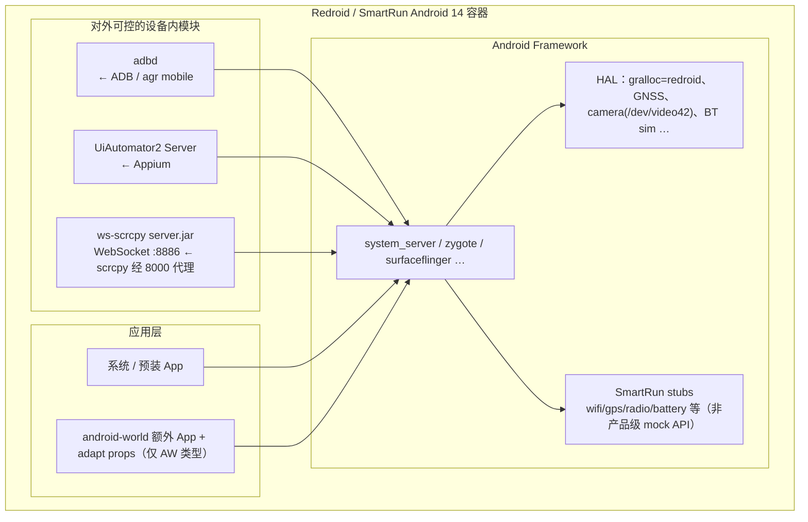
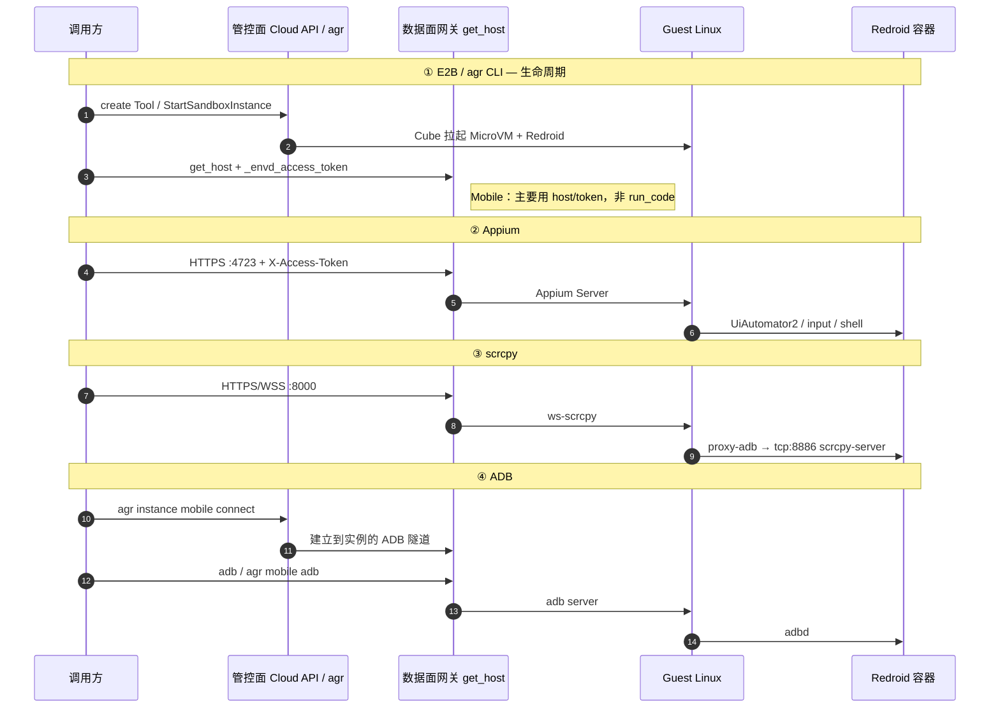

# Agent Runtime Mobile 架构（Cube + Redroid）

> 范围：腾讯云 Agent Runtime（AGS）**Mobile / android-world** 沙箱。  
> 依据：公开文档 + CubeSandbox 开源组件 + 实例内 ADB/属性探测（非腾讯官方内部蓝图全文）。  
> 图中标注：**加粗/实线 = 有较强证据**；*斜体 = 按端口与常见部署推断的落点*。

---

## 0. 聚焦：Guest Linux MicroVM + Redroid（模块 ↔ 对外服务）

外围（客户端、Cloud API、Cube Host）略。只展开 **MicroVM 里跑什么**，以及各自对应哪条对外服务。

> 两个常被漏画、但必须区分的组件：  
> - **shim-agent**：Cube 平台在 Guest 内的代理，经 **vsock** 对接 Host 上的 **CubeShim**（容器生命周期、就绪、日志转发等）。  
> - **envd**：E2B 兼容数据面守护进程（**TCP :49983**），承载 SDK 侧鉴权 token 模型 / health；完整 `commands`/`files` 主要在 code 类沙箱。Mobile 上官方交互仍以 Appium/ADB/scrcpy 为主。

\* `commands` / `files`：Cube/E2B 通用能力经 envd；**AGS Mobile 官方不把它当主路径**（无终端登录、不以 `commands.run` 文档化）。

### 端口速查（含 UiAutomator2 / adbd）

| 组件 | 默认端口 | 谁连谁 | 公开依据 |
|---|---|---|---|
| **Appium Server** | **4723** | 客户端 → Guest Appium | [AGS 手机操作](https://cloud.tencent.com/document/product/1814/127484) |
| **UiAutomator2（设备侧）** | **6790**（`serverPort`） | Appium 经 ADB `forward` 连到设备此口 | [appium-uiautomator2-driver](https://github.com/appium/appium-uiautomator2-driver) |
| **UiAutomator2（host 转发口）** | **8200–8299**（`systemPort`，取空闲） | Guest/本机 → forward → 设备 6790 | 同上 |
| **adb server（Guest/本机）** | **5037** | `adb` 客户端 → adb server | [Android 官方 adb](https://developer.android.com/tools/adb) |
| **adbd（设备 TCP）** | **5555**（`adb tcpip` / `adb connect` 默认） | adb server → 设备 adbd | 同上；`adb connect` 默认 PORT=5555 |
| **ws-scrcpy Web** | **8000** | 浏览器 → Guest | [AGS 手机操作](https://cloud.tencent.com/document/product/1814/127484) |
| **scrcpy-server（设备 WS）** | **8886** | 8000 代理 → 设备 | [ws-scrcpy](https://github.com/NetrisTV/ws-scrcpy) 惯例 + AGS 示例 `remote=tcp:8886` |
| **envd** | **49983** | E2B/Cube health、commands、files | [AGS 自定义沙箱端口](https://cloud.tencent.com/document/product/1814/129691)；[Cube envd](https://cubesandbox.com/guide/tutorials/bring-your-own-image.html) |
| **shim-agent** | **vsock**（非业务 TCP） | Host **CubeShim** ↔ Guest **shim-agent** | [CubeShim vsock](https://cubesandbox.com/architecture/overview.html)；changelog log-forwarding |

说明：

- 用户调 AGS **Appium 只打 4723**；**6790 / 8200–8299 是 Appium↔设备内部链路**，一般不直接 `get_host(6790)`。
- 用户调 AGS **ADB** 时，`agr instance mobile connect` 给出本地动态口（如 `127.0.0.1:39967`），云侧再转到实例内 **adbd**；设备 TCP 模式公开默认是 **5555**，USB/隧道场景则无对外固定 TCP 口。
- AGS 文档里 scrcpy 的 `udid=emulator-5554` 是展示名惯例，**不等于**经典 AVD；底层探测为 Redroid + Cube。

### 模块说明与对外服务一一对应

| 所在层 | 模块 | 端口 | 做什么 | 对外服务 |
|---|---|---|---|---|
| Guest Linux | **shim-agent** | vsock | 对接 Host **CubeShim**：容器 create/start、就绪、日志 | **agr CLI / 实例生命周期**（平台侧） |
| Guest Linux | **envd** | **49983** | health、token 模型；code 类 commands/files | **E2B Sandbox** |
| Guest Linux | *Appium Server* | **4723** | 收 Appium HTTP | **Appium**（入口） |
| Guest Linux | *adb server* | **5037** | 连设备 adbd，承接隧道 | **ADB** / **agr mobile** |
| Guest Linux | *ws-scrcpy* | **8000** | Web 投屏 + 代理到 8886 | **scrcpy**（入口） |
| Redroid | **adbd** | **5555**（TCP 默认） | 设备调试桥 | **ADB**（终点） |
| Redroid | **UiAutomator2** | **6790**（设备侧） | UI 自动化服务 | **Appium**（终点） |
| Redroid | **scrcpy-server** | **8886** | 画面/控制 WS | **scrcpy**（终点） |
| Redroid | Framework / HAL / stubs / Apps | — | 支撑上述通路 | 无独立对外 API |

### envd vs shim-agent（易混）

| | **shim-agent** | **envd** |
|---|---|---|
| 归属 | Cube 虚拟化/容器平台（Guest 侧） | E2B 协议数据面 |
| 通信 | **vsock** ↔ Host **CubeShim** | **TCP :49983**（经数据面网关 / token） |
| 主要职责 | 容器生命周期、就绪、日志 | SDK 操作沙箱（health；code 类 commands/files） |
| 用户是否直接调 | 否（agr/Cloud 启停间接触发） | 是（E2B SDK；Mobile 上能力收窄） |

### 对外服务 ← 模块（反查）

| 对外服务 | Guest Linux 模块 | Redroid 模块 | 端口 / 通道 |
|---|---|---|---|
| **E2B Sandbox** | **envd** | — | **49983**；业务口再 `get_host` |
| **agr CLI（生命周期）** | **shim-agent** | Redroid 由 agent 拉起 | vsock |
| **Appium** | Appium **:4723** | UiAutomator2 **:6790**（经 ADB forward） | 对外 **4723** |
| **scrcpy** | ws-scrcpy **:8000** | scrcpy-server **:8886** | **8000 → 8886** |
| **ADB** / **agr mobile** | adb server **:5037** | adbd **:5555**（TCP 默认） | 云隧道 → 本地动态口 |

### 公开资料 Verify（摘要）

| 断言 | 结论 | 来源 |
|---|---|---|
| AGS Mobile 对外 Appium **4723**、scrcpy **8000**、代理 **8886** | ✅ 文档示例一致 | [127484 手机操作](https://cloud.tencent.com/document/product/1814/127484) |
| envd **49983** = commands/files/health | ✅ AGS + Cube 一致 | [129691](https://cloud.tencent.com/document/product/1814/129691)；[Cube BYOI](https://cubesandbox.com/guide/tutorials/bring-your-own-image.html) |
| CubeShim ↔ Guest agent **vsock** | ✅ 开源架构/changelog | [Cube overview](https://cubesandbox.com/architecture/overview.html) |
| UiAutomator2 设备口 **6790**，host **8200–8299** | ✅ Appium 上游 | [uiautomator2-driver](https://github.com/appium/appium-uiautomator2-driver) |
| adbd TCP 默认 **5555**；adb server **5037** | ✅ Android 官方 | [developer.android.com/tools/adb](https://developer.android.com/tools/adb) |
| Mobile 主路径非 E2B commands；无终端登录 | ✅ AGS 操作边界 | [132411 终端连接](https://cloud.tencent.com/document/product/1814/132411)；tool 类型说明 |
| Guest 上 Appium/adb/ws-scrcpy 进程落点 | ⚠️ 推断 | 由端口与常见部署推出；AGS 未公开 guest 进程表 |
| AGS Mobile 镜像内是否常驻完整 envd | ⚠️ 部分证实 | token 命名与 E2B 兼容；Mobile 不以 49983 为官方主交互口 |

---

## 1. 总览：从客户端到 MicroVM（含外围，可选）

**对外服务 ↔ 入口对照**

| 对外服务 | 客户端怎么进 | 网关/映射 | 落到哪一层 |
|---|---|---|---|
| **agr CLI（管控）** | `agr tool/instance …` | Cloud API `:443` | 启停 Cube MicroVM / Tool 元数据 |
| **E2B Sandbox** | `Sandbox.create/kill`、`get_host`、token | 管控 + 数据面 | 生命周期；**Mobile 不以 run_code/commands 为主** |
| **Appium** | `https://{get_host(4723)}` + Token | **4723** | Guest 上 Appium → 容器内 UiAutomator2 |
| **scrcpy** | `https://{get_host(8000)}`，WS 代理 `tcp:8886` | **8000 → 8886** | Guest ws-scrcpy → 容器内 scrcpy-server |
| **ADB** | `agr instance mobile connect/adb` | 本地 `127.0.0.1:<port>` ↔ 云侧隧道 | Guest adb → 容器内 **adbd** |

---

## 2. Cube 宿主机层（底座）

| 模块 | 职责 |
|---|---|
| **Cubelet** | 接收管控面调度，拉起/回收沙箱 |
| **containerd** | 镜像与容器生命周期（Cube 依赖上游 containerd，非自研替代） |
| **CubeShim** | `containerd-shim-cube-rs`，把 OCI 任务接到 Cube VMM |
| **CubeHypervisor** | MicroVM（Cloud Hypervisor / RustVMM 系）+ KVM |

探测旁证：Guest 内 DMI 为 `cube-hypervisor` / `Cube Hypervisor`，内核形如 `6.6.69-cube.bm.guest…`。

---

## 3. Guest Linux 展开（MicroVM 内）

Guest 是一台完整 Linux；**Redroid 以容器形态跑在 Guest 内核上**（Redroid 视角的 “host” = 这台 Guest Linux，而不是裸金属宿主机）。

| Guest 模块 | 对应对外服务 | 说明 |
|---|---|---|
| **shim-agent** | **agr CLI / 实例生命周期** | 对接 Host **CubeShim**（vsock） |
| **envd :49983** | **E2B Sandbox** | health / token；Mobile 不以 commands 为主路径 |
| *Ingress / 端口代理* | E2B `get_host`、Token 鉴权后的流量 | 把公网映射端口转到内部 4723/8000/ADB |
| *adb server* | **ADB** / agr mobile | 维持到容器 `adbd` 的连接 |
| *Appium :4723* | **Appium** | 对外唯一自动化 HTTP 入口 |
| *ws-scrcpy :8000* | **scrcpy** | Web 页 + 把 WS 代理到设备 `tcp:8886` |
| Redroid 容器 | 全部设备侧能力 | 见下一节 |

> Mobile **不提供**控制台终端登录，也**不把** E2B `commands.run` / `run_code` / `files` 作为官方能力（那些面向 code-interpreter / all-in-one）。

---

## 4. Redroid 容器内展开

| 容器内模块 | 端口 / 通路 | 对外服务 |
|---|---|---|
| **adbd** | ADB 协议（经 Guest adb + 云隧道） | **ADB**、`agr instance mobile adb` |
| **UiAutomator2** | 由 Appium 经 ADB 拉起/会话 | **Appium** |
| **scrcpy-server（ws 模式）** | **8886**（ws-scrcpy 惯例，非 Redroid 标准口） | **scrcpy**（经 Guest **8000** 代理） |
| Framework + HAL | — | 被 ADB/Appium/投屏间接使用 |
| SmartRun stubs | — | **无**独立公开硬件 mock API |
| AW adapt / 预装 App | — | 仅 `android-world` Tool 类型 |

---

## 5. 对外服务一一对应（端到端）

### 对照表（画架构时用这张对齐）

| 对外服务 | 客户端 API / 命令 | 暴露端口 | Guest Linux | Redroid 内 |
|---|---|---|---|---|
| **E2B Sandbox** | `Sandbox.create/kill`、`get_host`、`_envd_access_token` | 443 + 映射主机名 | 实例存活与端口暴露 | （不直接跑 code interpreter） |
| **agr CLI** | `tool` / `instance` / `mobile connect\|adb` | 443；ADB 本地动态口 | 编排 + ADB 隧道终点 | adbd |
| **Appium** | `webdriver.Remote(get_host(4723))` | **4723** | Appium Server | UiAutomator2 |
| **scrcpy** | `get_host(8000)` + `remote=tcp:8886` | **8000 → 8886** | ws-scrcpy Web/代理 | scrcpy-server.jar |
| **ADB** | `adb -s 127.0.0.1:PORT` / `agr … adb -- shell …` | 本地映射口 | adb server | adbd |

---

## 6. 和「非 Mobile」沙箱的边界

| 类型 | Cube 底座 | E2B run_code / commands | 终端登录 | 主交互 |
|---|---|---|---|---|
| code-interpreter / all-in-one | 同类隔离底座（镜像不同） | ✅ | 部分支持 | envd / code 通路 |
| **mobile / android-world** | **Cube MicroVM + Redroid** | ❌ 非官方路径 | ❌ | Appium + ADB + scrcpy |
| browser / osworld | 各自预置环境 | 按类型文档 | 按类型文档 | CDP/VNC 等 |

---

## 7. 参考

- 实验记录：[`docs/experiments/tencent-agent-runtime-mobile-hardware-mock.md`](../experiments/tencent-agent-runtime-mobile-hardware-mock.md)
- 官方： [手机操作](https://cloud.tencent.com/document/product/1814/127484) · [Mobile ADB](https://cloud.tencent.com/document/product/1814/132412) · [终端连接限制](https://cloud.tencent.com/document/product/1814/132411)
- ws-scrcpy 端口惯例：Web **8000**，设备侧 WS **8886**
- CubeSandbox 开源组件名：Cubelet / CubeShim / CubeHypervisor
