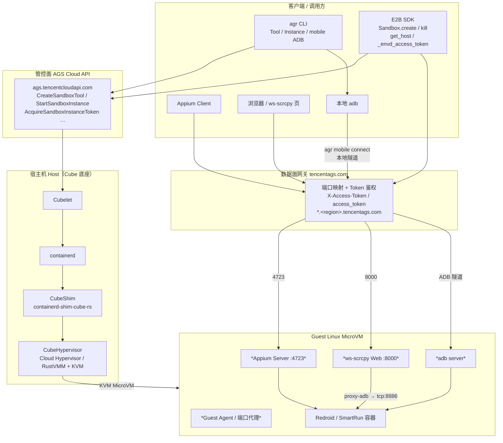
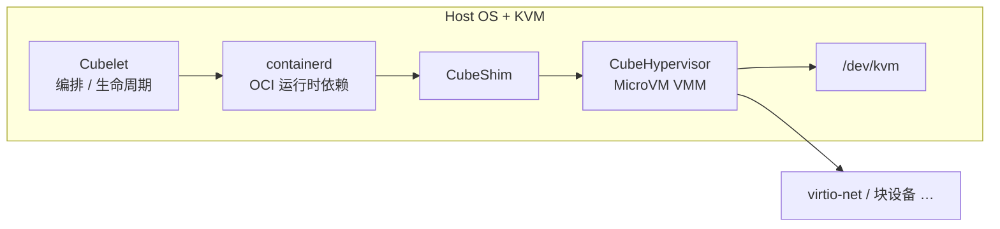
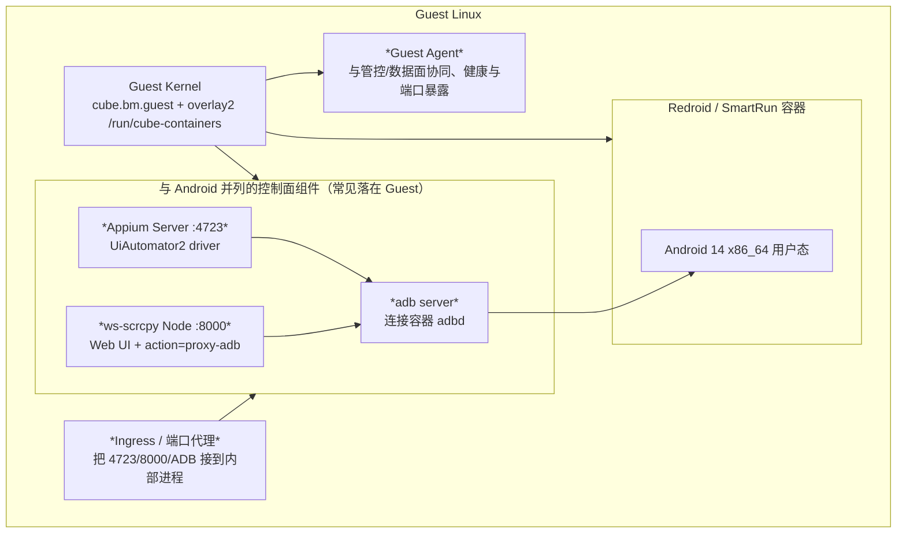
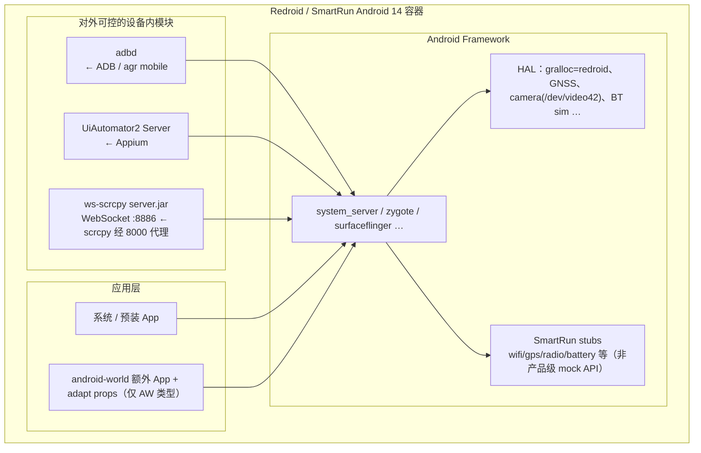
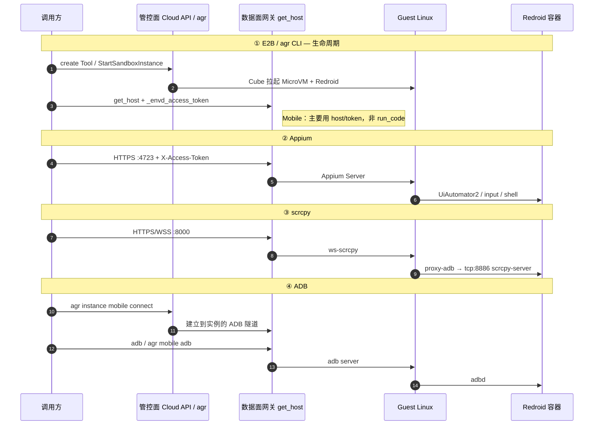

# Agent Runtime Mobile 架构（Cube + Redroid）

> 范围：腾讯云 Agent Runtime（AGS）**Mobile / android-world** 沙箱。  
> 依据：公开文档 + CubeSandbox 开源组件 + 实例内 ADB/属性探测（非腾讯官方内部蓝图全文）。  
> 图中标注：**实线框 = 有较强证据**；*斜体 = 按常见部署推断的落点*。

---

## 1. 总览：从客户端到 MicroVM

**对外服务 ↔ 入口对照**

| 对外服务 | 客户端怎么进 | 网关/映射 | 落到哪一层 |
|---|---|---|---|
| **agr CLI（管控）** | `agr tool/instance …` | Cloud API `:443` | 启停 Cube MicroVM / Tool 元数据 |
| **E2B Sandbox** | `Sandbox.create/kill`、`get_host`、token | 管控 + 数据面 | 生命周期；**Mobile 不以 run_code/commands 为主** |
| **Appium** | `https://{get_host(4723)}` + Token | **4723** | Guest 上 Appium → 容器内 UiAutomator2 |
| **scrcpy** | `https://{get_host(8000)}`，WS 代理 `tcp:8886` | **8000 → 8886** | Guest ws-scrcpy → 容器内 scrcpy-server |
| **ADB** | `agr instance mobile connect/adb` | 本地 `127.0.0.1:<port>` ↔ 云侧隧道 | Guest adb → 容器内 **adbd** |

---

## 2. Cube 宿主机层（底座）

| 模块 | 职责 |
|---|---|
| **Cubelet** | 接收管控面调度，拉起/回收沙箱 |
| **containerd** | 镜像与容器生命周期（Cube 依赖上游 containerd，非自研替代） |
| **CubeShim** | `containerd-shim-cube-rs`，把 OCI 任务接到 Cube VMM |
| **CubeHypervisor** | MicroVM（Cloud Hypervisor / RustVMM 系）+ KVM |

探测旁证：Guest 内 DMI 为 `cube-hypervisor` / `Cube Hypervisor`，内核形如 `6.6.69-cube.bm.guest…`。

---

## 3. Guest Linux 展开（MicroVM 内）

Guest 是一台完整 Linux；**Redroid 以容器形态跑在 Guest 内核上**（Redroid 视角的 “host” = 这台 Guest Linux，而不是裸金属宿主机）。

| Guest 模块 | 对应对外服务 | 说明 |
|---|---|---|
| *Guest Agent / 端口代理* | E2B `get_host`、Token 鉴权后的流量 | 把公网映射端口转到内部 4723/8000/ADB |
| *adb server* | **ADB** / agr mobile | 维持到容器 `adbd` 的连接 |
| *Appium :4723* | **Appium** | 对外唯一自动化 HTTP 入口 |
| *ws-scrcpy :8000* | **scrcpy** | Web 页 + 把 WS 代理到设备 `tcp:8886` |
| Redroid 容器 | 全部设备侧能力 | 见下一节 |

> Mobile **不提供**控制台终端登录，也**不把** E2B `commands.run` / `run_code` / `files` 作为官方能力（那些面向 code-interpreter / all-in-one）。

---

## 4. Redroid 容器内展开

| 容器内模块 | 端口 / 通路 | 对外服务 |
|---|---|---|
| **adbd** | ADB 协议（经 Guest adb + 云隧道） | **ADB**、`agr instance mobile adb` |
| **UiAutomator2** | 由 Appium 经 ADB 拉起/会话 | **Appium** |
| **scrcpy-server（ws 模式）** | **8886**（ws-scrcpy 惯例，非 Redroid 标准口） | **scrcpy**（经 Guest **8000** 代理） |
| Framework + HAL | — | 被 ADB/Appium/投屏间接使用 |
| SmartRun stubs | — | **无**独立公开硬件 mock API |
| AW adapt / 预装 App | — | 仅 `android-world` Tool 类型 |

---

## 5. 对外服务一一对应（端到端）

### 对照表（画架构时用这张对齐）

| 对外服务 | 客户端 API / 命令 | 暴露端口 | Guest Linux | Redroid 内 |
|---|---|---|---|---|
| **E2B Sandbox** | `Sandbox.create/kill`、`get_host`、`_envd_access_token` | 443 + 映射主机名 | 实例存活与端口暴露 | （不直接跑 code interpreter） |
| **agr CLI** | `tool` / `instance` / `mobile connect\|adb` | 443；ADB 本地动态口 | 编排 + ADB 隧道终点 | adbd |
| **Appium** | `webdriver.Remote(get_host(4723))` | **4723** | Appium Server | UiAutomator2 |
| **scrcpy** | `get_host(8000)` + `remote=tcp:8886` | **8000 → 8886** | ws-scrcpy Web/代理 | scrcpy-server.jar |
| **ADB** | `adb -s 127.0.0.1:PORT` / `agr … adb -- shell …` | 本地映射口 | adb server | adbd |

---

## 6. 和「非 Mobile」沙箱的边界

| 类型 | Cube 底座 | E2B run_code / commands | 终端登录 | 主交互 |
|---|---|---|---|---|
| code-interpreter / all-in-one | 同类隔离底座（镜像不同） | ✅ | 部分支持 | envd / code 通路 |
| **mobile / android-world** | **Cube MicroVM + Redroid** | ❌ 非官方路径 | ❌ | Appium + ADB + scrcpy |
| browser / osworld | 各自预置环境 | 按类型文档 | 按类型文档 | CDP/VNC 等 |

---

## 7. 参考

- 实验记录：[`docs/experiments/tencent-agent-runtime-mobile-hardware-mock.md`](../experiments/tencent-agent-runtime-mobile-hardware-mock.md)
- 官方： [手机操作](https://cloud.tencent.com/document/product/1814/127484) · [Mobile ADB](https://cloud.tencent.com/document/product/1814/132412) · [终端连接限制](https://cloud.tencent.com/document/product/1814/132411)
- ws-scrcpy 端口惯例：Web **8000**，设备侧 WS **8886**
- CubeSandbox 开源组件名：Cubelet / CubeShim / CubeHypervisor
