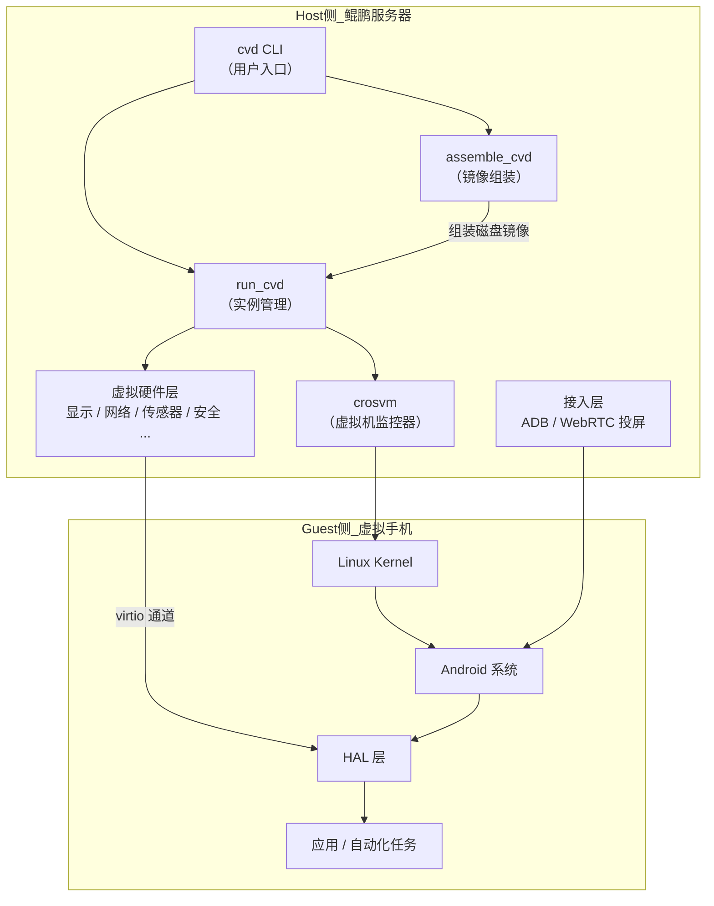
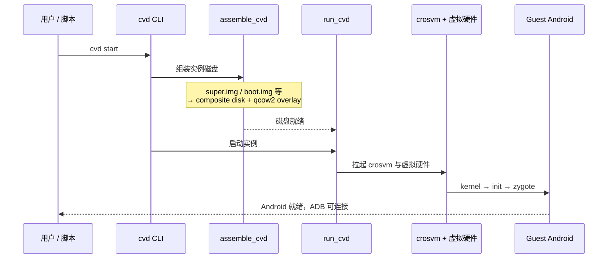

# 基于 Cuttlefish 的鲲鹏 Android 沙箱 — 技术导入与计划

> **文档性质**：部门内部技术导入帖草稿  
> **状态**：v0.7

---

## 一、Android 沙箱的诉求

### 1.1 本质需求

Android 沙箱要解决的问题是：**在隔离环境中，按需交付一台可编程的「虚拟手机」，用完即毁，可大规模并行**。

与传统真机或开发用模拟器不同，沙箱面向的是自动化场景——机器而非人来操作手机。近两年随着 Code Agent 和大模型训练需求爆发，这个能力从「测试辅助工具」变成了「基础设施」。

### 1.2 业界典型场景

#### 美团：CodeAgent 生成代码后的自动化测试

```
需求描述 / PRD
    ↓
CodeAgent 生成 Android 代码（Activity、UI 布局、业务逻辑等）
    ↓
自动构建 APK
    ↓
投递到 Android 沙箱
    ↓
自动化测试（安装 → 启动 → UI 操作 → 断言 → 截图/日志）
    ↓
结果反馈给 Agent，驱动下一轮代码修正
```

若依赖物理真机或人工调试，CodeAgent 的「生成 → 验证 → 修正」闭环无法自动化。Android 沙箱是把 CodeAgent 从「只能写代码」变成「能写能验」的关键基础设施。

#### 腾讯：部署 AndroidWorld 供大模型场景训练

[AndroidWorld](https://github.com/google-research/android_world) 是 Google Research 发布的 Android 环境基准，包含 116 个真实 App 操作任务，用于评估和训练 GUI Agent / Mobile Agent。

腾讯在 Agent Runtime（AGS）中将 AndroidWorld 作为预置沙箱类型（`android-world` Tool）对外提供：

```
大模型 / Agent 训练框架
    ↓
申请 android-world 沙箱实例
    ↓
沙箱内预装 AndroidWorld 任务环境（App 集 + 任务初始化脚本）
    ↓
Agent 通过 Appium / ADB 在虚拟手机上执行任务
    ↓
采集操作轨迹（点击序列、截图、任务完成状态）
    ↓
作为 RL / SFT 训练数据或评测指标
```

这类场景对沙箱的要求远高于普通自动化测试：需要预装特定 App 集、硬件 mock（GPS/短信/传感器）、episode 间环境重置、百级并行、长时稳定运行。

### 1.3 核心能力诉求

把上述场景抽象，一个可用的 Android 沙箱需要具备：

| 能力 | 说明 | CodeAgent 测试 | AndroidWorld 训练 |
|------|------|:--------------:|:-----------------:|
| **快速创建/销毁** | 按需交付干净环境，任务结束即回收 | ●●● | ●●● |
| **可编程操控** | 通过 ADB / Appium 安装 App、注入操作、采集结果 | ●●● | ●●● |
| **环境一致性** | 固定 Android 版本与系统配置，结果可复现 | ●●● | ●●● |
| **大规模并行** | 多任务/多训练 episode 同时跑，互不干扰 | ●● | ●●● |
| **环境可定制** | 预装 App、定制镜像、按需启用硬件能力 | ●● | ●●● |
| **硬件 mock** | GPS、传感器、短信等虚拟硬件可注入 | ● | ●●● |
| **环境可重置** | episode 间恢复到干净初始状态 | ●●● | ●●● |
| **可观测** | 日志、截图、录屏、操作轨迹 | ●●● | ●●● |
| **长时稳定运行** | 训练任务可持续数小时不崩溃 | ●● | ●●● |

### 1.4 对底层引擎的要求

上述能力最终落到执行引擎上，引擎需要满足：

- 运行**完整 Android 系统**，行为尽可能接近真机，而非轻量容器
- 支持**多实例部署**，单机可并行多个独立虚拟手机
- 镜像**可定制**（裁剪、预装 App、场景 overlay）
- 虚拟硬件**可按需配置**（全量模拟 vs 最小集 vs 定向增强）
- 在目标算力平台（鲲鹏 ARM）上**原生运行**，无跨架构损耗
- 具备**启动加速**手段（snapshot、预热池等），支撑高频创建销毁

### 1.5 业界参考：E2B Sandbox

近期我们调研了开源 [E2B Sandbox](https://e2b.dev/) 方案。E2B 面向 AI Agent 提供隔离代码执行环境，其核心技术点可以概括为：

> **沙箱即恢复的快照。**

E2B 并不是每次请求都从零启动一台完整环境，而是：

1. **预先构建模板镜像**，将环境启动到就绪状态后打快照（snapshot）
2. **创建沙箱时从快照恢复**，而非冷启动——相当于「暂停的 VM 直接 resume」
3. **任务结束后销毁**，下次需要时再基于同一快照恢复一台干净实例

```
模板构建（一次性）          每次使用沙箱
     ↓                        ↓
 环境启动到就绪  →  打快照  →  从快照恢复  →  执行任务  →  销毁
                              （秒级）              （干净环境）
```

这对 Android 沙箱的启发是：**「快」的关键不在于把冷启动做得多快，而在于能不能用快照把「已就绪的 Android 环境」直接恢复出来。** Cuttlefish 同样具备 snapshot 能力，这是我们后续启动优化的重要方向。

### 1.6 我们的选型方向

基于以上诉求，部门选择 **Cuttlefish + 鲲鹏** 作为 Android 沙箱的虚拟设备引擎，在国产化 ARM 算力上构建自主可控的底层能力。

> 通用沙箱平台能力（API 服务化、调度编排、多租户等）在部门其他材料中已有阐述，本文聚焦 Cuttlefish 引擎层。

---

## 二、Cuttlefish 是什么

[Cuttlefish](https://source.android.com/docs/devices/cuttlefish) 是 Google AOSP 官方提供的**虚拟 Android 设备（Virtual Device）**方案，主要面向 CI/测试与云化部署。它在鲲鹏服务器（Host）上通过虚拟化运行完整 Android 系统（Guest），并模拟一台手机的硬件——显示、网络、传感器、安全芯片等。

**当前进展**：已在鲲鹏环境打通 Cuttlefish 启动，对整体架构有基本理解。

### 2.1 总体模型：Host / Guest 分离



- **Guest**：完整 Android 系统，从 kernel 到 App，与真机同源
- **Host**：用 crosvm 跑虚拟机 + 虚拟硬件组件对接 Android HAL 层
- **接入**：外部通过 ADB、WebRTC 与 Guest 交互

与 Emulator、真机的定位差异：

| 维度 | 真机 | Emulator | Cuttlefish |
|------|------|----------|------------|
| 真实性 | 最高 | 中 | 较高（完整设备栈） |
| 云化多实例 | 难 | 可行 | **设计目标之一** |
| 启动与编排 | 差 | 好 | 较好，适合 CI |
| ARM 原生 | 是 | 部分 | **是** |
| 适用场景 | 最终验证 | 日常开发 | **自动化测试、云沙箱** |

### 2.2 启动链路



| 阶段 | 组件 | 职责 |
|------|------|------|
| 命令入口 | `cvd` | 解析参数，协调启动流程 |
| 镜像组装 | `assemble_cvd` | 将 AOSP 构建产物组装为可启动磁盘；多实例只组装一次 |
| 实例管理 | `run_cvd` | 拉起 crosvm、虚拟硬件，管理生命周期 |
| 虚拟化 | `crosvm` | VMM，负责 CPU/内存虚拟化 |
| 虚拟硬件 | Host 侧组件 | 通过 virtio 与 Guest HAL 通信 |
| 系统启动 | Guest Android | 标准 boot 流程至 system_server 就绪 |

### 2.3 磁盘与镜像

Cuttlefish 使用**组合磁盘（composite disk）**：AOSP 构建产物（`boot.img`、`super.img` 等）逻辑合并后，通过 **qcow2 overlay** 实现多实例写时复制隔离——基底只读共享，各实例写入互不影响。镜像体积和分区内容直接影响启动速度和部署密度。

### 2.4 虚拟硬件层

| 功能域 | 模拟内容 | 与沙箱的关系 |
|--------|----------|-------------|
| 显示 / 图形 | 屏幕、GPU 渲染 | UI 自动化、App 渲染 |
| 网络 | 虚拟网卡、NAT | App 联网、网络隔离 |
| 输入 | 触摸、按键 | UI 自动化注入 |
| 安全 | Keymaster、Gatekeeper 等 | Android 安全栈启动的必要条件 |
| 传感器 / GNSS | 加速度计、GPS | AndroidWorld 等场景依赖 |
| 音频 / 相机 / 蓝牙 | 多媒体与外设 | 按场景可选 |

默认启用较完整硬件集，对沙箱存在过度模拟——很多场景不需要，却消耗资源和启动时间。

### 2.5 对外接入

| 通道 | 用途 |
|------|------|
| **ADB** | 安装 APK、shell 命令、UI 自动化——CodeAgent 测试和 AndroidWorld 的主通道 |
| **WebRTC** | 远程投屏、录屏 |
| **cvd CLI** | 实例创建、停止、状态查看 |

### 2.6 架构小结

```
┌─────────────────────────────────────────────┐
│  接入层：ADB / WebRTC / cvd CLI              │
├─────────────────────────────────────────────┤
│  Host 层：cvd → assemble_cvd → run_cvd      │
│           crosvm + 虚拟硬件                  │
├─────────────────────────────────────────────┤
│  Guest 层：完整 Android 系统                 │
├─────────────────────────────────────────────┤
│  镜像层：AOSP 构建产物 → composite disk      │
└─────────────────────────────────────────────┘
```

Cuttlefish 是优秀的**虚拟设备引擎**，但不是完整的**沙箱平台**——控制面、API、多租户、可观测性等需在其上建设。引擎层后续优化集中在**镜像层**和 **Host 层**。

---

## 三、现在在做什么

**Phase 0：跑通基线、摸清边界。**

### 已完成

- 鲲鹏环境部署 Cuttlefish 依赖，成功启动实例，ADB 可连接
- 理解 Host/Guest 架构与启动链路

### 进行中

| 摸底项 | 关注指标 |
|--------|----------|
| 资源占用 | 单实例 CPU、内存、磁盘（空闲 / 负载） |
| 启动时延 | `cvd start` → Android 就绪总耗时及各阶段拆分 |
| 并行能力 | 单机稳定运行的最大实例数 |
| 稳定性 | 长时运行、反复创建/销毁的成功率 |

---

## 四、未来计划做什么

### 4.1 镜像裁剪

默认 AOSP 镜像体积大，含大量开发调试组件。计划分析各分区移除非必要内容，基于 `lunch aosp_cf_*` 定制构建，建立「基础精简镜像 + 场景 overlay」分层（如 AndroidWorld 适配层叠加在基础镜像上）。

### 4.2 启动优化

冷启动偏慢，不适合高频创建销毁。计划对全链路 profiling 定位瓶颈，探索 snapshot 预热池，减少启动时虚拟硬件加载，优化多实例并行启动的 I/O 调度。

### 4.3 渲染优化

UI 自动化依赖 display/input 链路，部分 App 强依赖 GPU。计划摸底鲲鹏上渲染路径（virgl / gfxstream / swiftshader），验证 headless 下 UIAutomator/Appium 可用性，评估 GPU 加速可行性。

### 4.4 硬件模拟裁剪与增强

默认硬件模拟过多，但 AndroidWorld 又需要 GPS/传感器/短信。计划按场景定义「最小硬件集」，默认最小集启动，对必要硬件提供可编程注入接口。

### 推进节奏

| 阶段 | 重点 | 里程碑 |
|------|------|--------|
| **Phase 0**（当前） | 基线摸底 | 资源、启动时延、并行能力有数据 |
| **Phase 1** | 镜像裁剪 + 启动优化 | 精简镜像可用；启动时延有改善 |
| **Phase 2** | 渲染优化 + 硬件模拟 | 目标 App 兼容；最小硬件集落地 |

---

## 五、预期收益

| 优化方向 | 收益 |
|----------|------|
| 镜像裁剪 | 磁盘 ↓，单机实例数 ↑，分发加速 |
| 启动优化 | 冷启动时延 ↓，CodeAgent 迭代加速，训练环境快速周转 |
| 渲染优化 | 更多 App 可运行，自动化更稳定 |
| 硬件模拟 | Host 开销 ↓，支撑 AndroidWorld 类场景 |

| 指标 | 当前 | 目标方向 |
|------|------|----------|
| 单实例内存 | 待测 | ↓ 30%~50% |
| 冷启动时延 | 待测 | ↓ 显著 |
| 单机并行实例数 | 待测 | ↑ |
| App 兼容覆盖率 | 待测 | ↑ |

---

## 六、总结

1. **诉求**：CodeAgent 测试、AndroidWorld 训练等场景，要求 Android 沙箱能快速交付、大规模并行、可编程操控、环境可定制。
2. **引擎**：Cuttlefish 是 AOSP 官方虚拟设备方案，Host（crosvm + 虚拟硬件）+ Guest（完整 Android），已在鲲鹏跑通。
3. **现在**：基线摸底——资源、启动时延、并行能力、稳定性。
4. **未来**：镜像裁剪、启动优化、渲染优化、硬件模拟，让 Cuttlefish 从「能跑」到「好用、够密、够快」。

---

*文档版本：v0.7 | 最后更新：2026-08*
