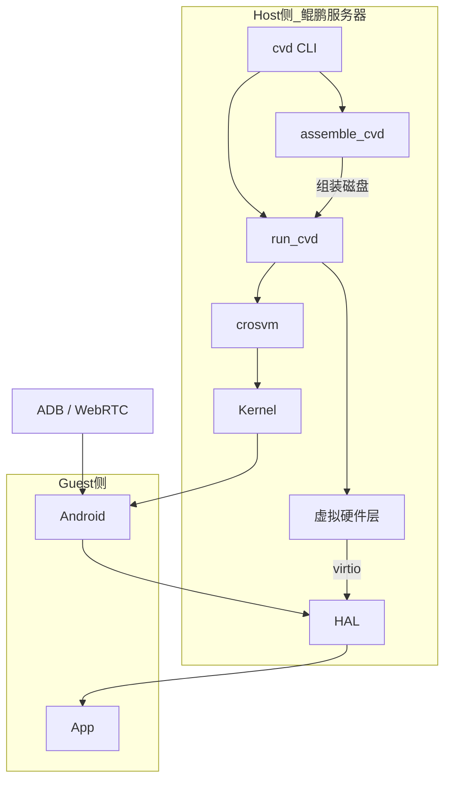

# 基于 Cuttlefish 的鲲鹏 Android 沙箱 — 技术导入与计划

> **文档性质**：部门内部技术导入帖草稿  
> **状态**：v1.1

---

## 一、背景

### 1.1 Android 沙箱诉求

Android 沙箱要解决的问题是：**在隔离环境中，按需交付一台可编程的「虚拟手机」，用完即毁，可大规模并行**。沙箱面向自动化场景——机器而非人来操作手机，是 Code Agent 和大模型训练的基础设施而非测试辅助工具。

**美团 CodeAgent 自动化测试**：CodeAgent 生成 Android 代码 → 构建 APK → 投递沙箱 → UI 自动化测试 → 结果反馈驱动下一轮修正。要求沙箱快速创建销毁、ADB 可编程操控、多任务并发、环境一致、测试可观测。

**腾讯 AndroidWorld 大模型训练**：在 AGR 上提供 `android-world` 预置沙箱，Agent 通过 Appium/ADB 在虚拟手机上执行 116 个真实 App 操作任务，采集轨迹作为训练数据。要求预装 App 集、硬件 mock、episode 间环境重置、百级并行、长时稳定。

归纳下来，底层引擎需要：运行完整 Android 系统、支持多实例部署、镜像可定制、虚拟硬件可按需配置、鲲鹏 ARM 原生运行、具备启动加速手段。

部门选择 **Cuttlefish + 鲲鹏** 作为虚拟设备引擎——AOSP 官方虚拟设备方案，ARM 原生，完整设备栈，适合云化多实例部署。

> 通用沙箱平台能力（API 服务化、调度编排、多租户等）在部门其他材料中已有阐述，本文聚焦 Cuttlefish 引擎层。

### 1.2 Cuttlefish 架构

[Cuttlefish](https://source.android.com/docs/devices/cuttlefish) 在鲲鹏服务器（**Host**）上通过虚拟化运行完整 Android 系统（**Guest**），并模拟手机硬件——显示、网络、传感器、安全芯片等。



**启动链路**：`cvd start` → `assemble_cvd` 组装磁盘（`super.img` / `boot.img` → composite disk + qcow2 overlay）→ `run_cvd` 拉起 crosvm 和虚拟硬件进程 → Guest Android boot → ADB 可连接。多实例时 `assemble_cvd` 执行一次，`run_cvd` 按实例数执行多次。

**`run_cvd` 进程模型**：`run_cvd` 是实例的进程总管，拉起并协调 crosvm（VMM）、ADB 连接器、WebRTC 投屏、WiFi/蓝牙/NFC 仿真、GNSS proxy、secure_env（Keymaster/Gatekeeper）、日志监控等 Host 侧组件。默认启用较完整硬件集，对沙箱存在过度模拟。

**磁盘模型**：基底镜像只读共享，各实例通过 qcow2 overlay 写时复制隔离——多实例部署的基础。

**对外接入**：ADB（自动化主通道）、WebRTC（投屏/录屏）、cvd CLI（生命周期管理）。

```
┌─────────────────────────────────────────────┐
│  接入层：ADB / WebRTC / cvd CLI              │
├─────────────────────────────────────────────┤
│  Host 层：cvd → assemble_cvd → run_cvd      │
│           crosvm + 虚拟硬件                  │
├─────────────────────────────────────────────┤
│  Guest 层：完整 Android 系统                 │
├─────────────────────────────────────────────┤
│  镜像层：AOSP 构建产物 → composite disk      │
└─────────────────────────────────────────────┘
```

Cuttlefish 是虚拟设备**引擎**，不是沙箱**平台**。后续引擎层优化集中在**镜像层**和 **Host 层**。

---

## 二、行业调研：我们看了什么、学到了什么

选定 Cuttlefish 作为引擎之后，还有一个问题需要回答：**业界已经跑通的沙箱，核心做法是什么，哪些可以直接借鉴到 Android 引擎层？**

我们分别从两条路线做了调研——一条关注**沙箱怎么快**（E2B，通用 Agent 执行环境），一条关注**Android 怎么跑**（腾讯 AGR，已落地的 Mobile / AndroidWorld 沙箱）。前者给出交付速度的技术范式，后者给出 Android 场景化的产品范式。以下分述调研结论及对 Cuttlefish 的启示，文末做对照判断。

### 2.1 E2B Sandbox：沙箱即恢复的快照

[E2B Sandbox](https://e2b.dev/) 面向 AI Agent 提供隔离执行环境，底层基于 Firecracker MicroVM。核心技术点：

> **沙箱即恢复的快照。**

预先构建模板镜像并打快照；创建沙箱时从快照恢复而非冷启动；任务结束后销毁，下次再从同一快照恢复干净实例。

```
环境启动到就绪  →  打快照  →  从快照恢复（秒级）  →  执行任务  →  销毁
```

**对 Android 沙箱的启示**：

- 「快」的关键不是冷启动快，而是能从快照恢复「Android 已就绪、ADB 可用」的环境
- 模板 + 快照是核心资产；销毁后恢复即环境重置
- Cuttlefish 底层 crosvm 具备 snapshot 能力，但官方标注为 [highly experimental](https://crosvm.dev/book/architecture/snapshotting.html)——格式不稳定、仅支持极少数设备、Host 侧多进程协同存在数据丢失窗口、不支持热 restore，短期内不能作为可靠生产能力依赖

### 2.2 腾讯 AGR：VM + Redroid 的 Android 沙箱

[Agent Runtime（AGR）](https://cloud.tencent.com/document/product/1814) 提供 Mobile / `android-world` 沙箱，底层为 **MicroVM + Redroid 容器**：

```
Guest Linux MicroVM
    ├── shim-agent（容器生命周期，vsock 对接 Host）
    ├── Appium :4723 / adb server :5037
    └── Redroid 容器
            ├── adbd :5555 / UiAutomator2 :6790
            ├── Android Framework + HAL
            └── 预装 App + 场景适配层（android-world）
```

VM 提供隔离，Redroid 容器提供 Android 运行时——更轻量，但 HAL/硬件行为与完整虚拟设备有差距。对外以 Appium + ADB + scrcpy 交付；`android-world` 在基础镜像上叠加适配层（预装 App、Telephony bootstrap 等）。

**对 Android 沙箱的启示**：

- 场景化镜像是关键：基础镜像 + 场景 overlay，而非一套镜像打天下
- 自动化接口对齐 Appium / ADB 业界标准
- 硬件能力靠镜像内 stub 和 bootstrap 脚本实现，而非运行时动态 mock API
- episode 重置靠容器重建或初始化脚本

### 2.3 对照与判断

| 维度 | E2B | 腾讯 AGR | Cuttlefish（我们） |
|------|-----|----------|-------------------|
| 核心思路 | 快照恢复，秒级交付 | VM + 容器，场景化镜像 | 完整虚拟设备 + 快照加速 |
| Android 形态 | — | Redroid 容器 | AOSP 完整设备栈 |
| 真实性 | — | 中 | 较高 |
| 交付速度 | 极快 | 较快 | 待优化 |
| 场景定制 | 模板镜像 | 基础镜像 + overlay | 精简镜像 + overlay |

E2B 告诉我们「快」靠快照；AGR 告诉我们「怎么用」靠场景化镜像和标准自动化接口。Cuttlefish 在真实性上优于 Redroid，但需补齐快照加速、镜像裁剪和 Host 进程裁剪。

---

## 三、当前进展与未来优化

### 3.1 当前进展（Phase 0）

| 状态 | 内容 |
|------|------|
| ✅ 已完成 | 鲲鹏环境跑通 Cuttlefish，ADB 可连接；理解 Host/Guest 架构与 `run_cvd` 进程模型 |
| 🔄 进行中 | 基线摸底：单实例资源占用、启动时延（含各阶段拆分）、单机并行上限、稳定性 |

### 3.2 未来优化方向

| 方向 | 问题 | 计划 | 预期收益 |
|------|------|------|----------|
| **镜像裁剪** | 默认 AOSP 镜像体积大，含大量调试组件 | 分区瘦身、`lunch aosp_cf_*` 定制构建、「基础精简镜像 + 场景 overlay」 | 磁盘 ↓，单机实例数 ↑ |
| **启动优化** | 冷启动偏慢，不适合高频创建销毁 | 全链路 profiling；探索 crosvm snapshot 预热池；减少启动时虚拟硬件加载 | 交付时延 ↓，CodeAgent 迭代加速 |
| **渲染优化** | UI 自动化依赖 display/input；部分 App 强依赖 GPU | 摸底 virgl/gfxstream/swiftshader；验证 headless 下 UIAutomator/Appium | 更多 App 可运行 |
| **进程/硬件裁剪** | `run_cvd` 默认拉起全套虚拟硬件进程，资源浪费 | 按场景定义最小进程集（如 UI 测试 = crosvm + ADB + display/input + network）；按需启用 GNSS/modem 等 | Host 开销 ↓，启动加速 |

### 3.3 推进节奏

| 阶段 | 重点 | 里程碑 |
|------|------|--------|
| **Phase 0**（当前） | 基线摸底 | 资源、启动时延、并行能力有数据 |
| **Phase 1** | 镜像裁剪 + 启动优化 | 精简镜像可用；启动时延有量化改善 |
| **Phase 2** | 渲染优化 + 进程/硬件裁剪 | 目标 App 兼容；最小进程集落地 |

---

## 四、总结

CodeAgent 自动化测试和 AndroidWorld 大模型训练等场景，推动 Android 沙箱从辅助工具变为基础设施——核心诉求是快速交付、大规模并行、ADB/Appium 可编程操控、场景化环境定制。

我们选择 Cuttlefish + 鲲鹏作为引擎路线，看重的是 AOSP 官方完整设备栈在 ARM 上的原生支持与云化多实例能力。Cuttlefish 已在鲲鹏跑通，当前处于基线摸底阶段。

行业调研给出两条明确启发：E2B 的「沙箱即恢复快照」指明了交付速度的方向，但 crosvm snapshot 尚处 highly experimental 阶段，需审慎验证；腾讯 AGR 的「VM + Redroid + 场景 overlay + Appium/ADB」指明了 Android 沙箱的产品化路径，Cuttlefish 在真实性上更优，但需在镜像裁剪、启动加速、进程裁剪上追赶交付效率。

下一步围绕四个方向推进：镜像裁剪降低部署成本，启动优化（含 snapshot 探索）缩短交付时延，渲染优化扩大 App 覆盖，进程/硬件裁剪提升单机密度。目标让 Cuttlefish 从「能跑」走向「够快、够密、够用」。

---

*文档版本：v1.1 | 最后更新：2026-08*
